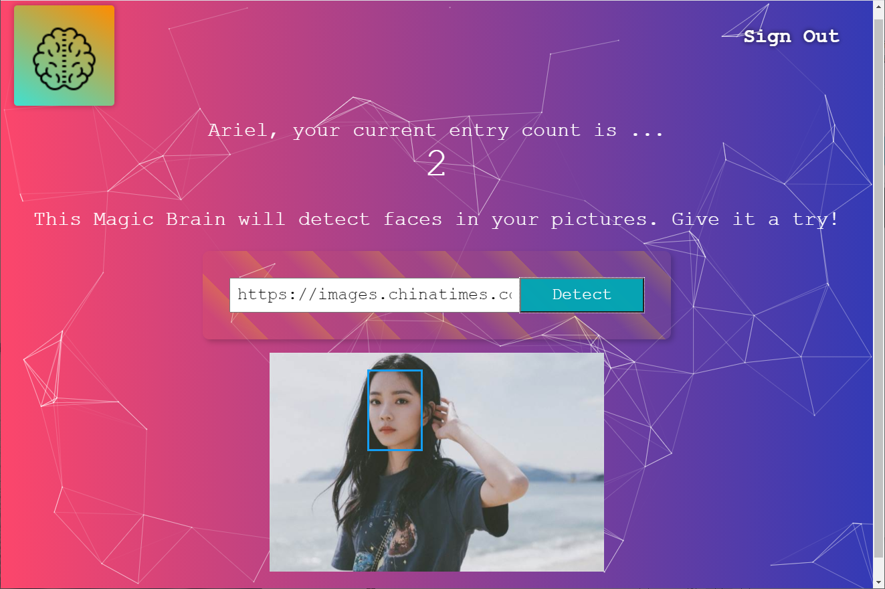

# Smart Brain: Face Detection App (Full-Stack)

## About

A face recognition web app uses Clarifai Face Detection API to detect and highlight human face after user submitted an image URL. Back-end of the app utilizes Node.js, Express.js, PostgresSQL and bcrypt-nodejs to provide secure user authentication, storage and password hashing.

## Resource

- [Clarifai API](https://www.clarifai.com/)
- [bcrypt-nodejs](https://www.npmjs.com/package/bcrypt-nodejs)
- [NextJs]
- [NextUI]
- [tailwindcss]
- [particles-bg]
